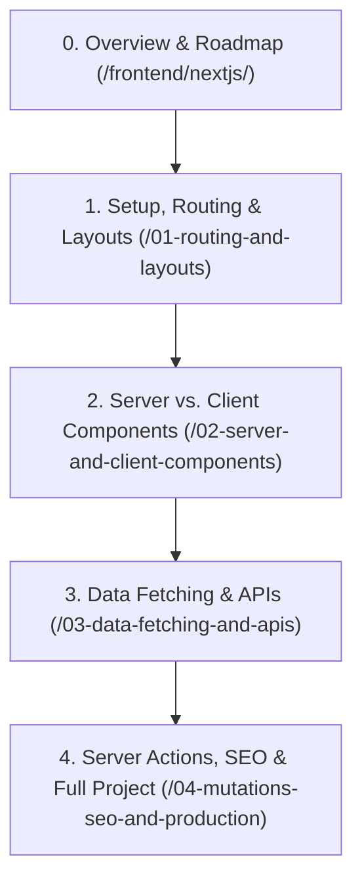

# Next.js Full-Stack Architecture Track

> A comprehensive, beginner-friendly masterclass covering modern Next.js, the App Router, React Server Components (RSC), Server Actions, and complete full-stack web engineering.

---

## The Big Picture: Why Does Next.js Exist?

To truly appreciate Next.js, let us take a short journey through how websites have been built over the past 25 years:

```text
┌──────────────────────────────────────────────────────────────────────────────────┐
│                           THE EVOLUTION OF WEB ARCHITECTURE                      │
│                                                                                  │
│   1995 - 2010          2013 - 2020                 2023 - Present                │
│   Classic Multi-Page   Client-Side SPAs (React)    Full-Stack Hybrid (Next.js)   │
│                                                                                  │
│   [Server sends HTML]  [Server sends empty HTML]   [Server pre-renders HTML]     │
│          │             [Browser downloads 3MB JS]  [Zero JS for static parts]    │
│          ▼             [Browser builds DOM]        [Interactive parts hydrate]   │
│   Slow page refresh    White screen on slow 3G     Instant load + fast clicks    │
└──────────────────────────────────────────────────────────────────────────────────┘
```

### 1. The Era of Multi-Page Websites (1995 – 2010)
In the early days (PHP, Ruby on Rails, or plain HTML):
* When a user clicked a link (e.g., `<a href="/about.html">`), the browser threw away the current screen, showed a **white flash**, requested the new page from the server, and reloaded the whole page.
* **The Problem:** Slow user experience, choppy transitions, and repetitive server work.

### 2. The Era of Client-Side Single Page Applications (SPAs with React & Vite: 2013 – 2020)
Then came modern React. Instead of reloading the page:
* The server sends an almost empty HTML file: `<div id="root"></div>`.
* The browser downloads a large JavaScript bundle (2MB–5MB).
* JavaScript runs in the browser, talks to APIs via `fetch()`, builds the DOM, and updates the screen smoothly without page reloads.
* **The New Dilemmas:**
  1. **Terrible Initial Load:** On mobile devices or slow cellular connections, users stare at a blank white screen or loading spinners for seconds while heavy JavaScript downloads.
  2. **SEO & Social Share Nightmare:** Search engine crawlers and social media bots (Google, Twitter/X, WhatsApp) often see only `<div id="root"></div>`, failing to read your article titles or preview images.
  3. **Security Leaks:** If you accidentally use a secret API key or database query inside a client React component, it gets bundled and shipped directly to the user's browser where anyone can inspect it!
  4. **Waterfall Requests:** Component A loads, fetches data, renders Component B, which fetches more data—creating slow sequential cascades.

### 3. The Modern Solution: Next.js App Router
Next.js solves every single one of these problems by uniting the best of both worlds:
* **Server Power:** Renders rich HTML directly on the server (instant first paint, perfect SEO, zero secret leaks, direct database access).
* **Client Smoothness:** Once loaded, it seamlessly navigates between pages without page reloads using client-side prefetching.
* **Zero Extra JavaScript:** Components that do not need user interaction (like static text, footers, markdown blogs) send **0 kilobytes of JavaScript** to the browser!

---

## How This Guide is Structured

This handbook is divided into 4 hands-on chapters. By the end of this curriculum, you will have the knowledge and confidence to build any multi-page website or web application from scratch:



1. **[1. Setup, Routing & Layouts](./01-routing-and-layouts)**:
   - Installing Node.js and setting up a brand-new Next.js project from scratch.
   - Mastering the App Router file system: `page.js`, `layout.js`, `not-found.js`, and `loading.js`.
   - Client-side navigation with `<Link>` and dynamic routes (`[slug]`).
   - *Vanilla Web Comparison:* How we handled routing with separate `.html` files or manual `history.pushState()`.
2. **[2. Server vs. Client Components](./02-server-and-client-components)**:
   - Understanding React Server Components (RSC) vs. Client Components (`'use client'`).
   - How hydration works and when to use each component type.
   - Composing server and client components cleanly.
   - *Vanilla Web Comparison:* How event listeners and DOM manipulation were handled with `document.querySelector` and `addEventListener`.
3. **[3. Data Fetching & APIs](./03-data-fetching-and-apis)**:
   - Direct `async/await` data fetching inside server components (goodbye `useEffect` boilerplate!).
   - Static Site Generation (SSG), Dynamic Rendering, and Incremental Revalidation.
   - Creating backend REST endpoints using Route Handlers (`app/api/.../route.js`).
   - *Vanilla Web Comparison:* How we fetched data manually using `XMLHttpRequest` / `fetch()` and manual DOM insertion.
4. **[4. Server Actions, SEO & Full Project](./04-mutations-seo-and-production)**:
   - Submitting forms and mutating data with Server Actions (`'use server'`).
   - Core Web Vitals optimization with `<Image />` and `next/font`.
   - Dynamic SEO metadata generation (`generateMetadata`).
   - **Capstone Project:** Building a complete multi-page Agency Website from scratch with full source code.

---

## Prerequisites

Before starting this track, you only need:
1. **Basic HTML & CSS:** Knowing what tags, forms, flexbox, and divs are.
2. **Core JavaScript:** Understanding variables (`const`/`let`), arrow functions, object destructuring, and basic `async/await` (all covered in our [JavaScript Track](../javascript/)).
3. **A computer with terminal access:** We will walk you through downloading Node.js and installing Next.js step-by-step in Chapter 1.

Let's jump into [Chapter 1: Setup, Routing & Layouts](./01-routing-and-layouts)!
